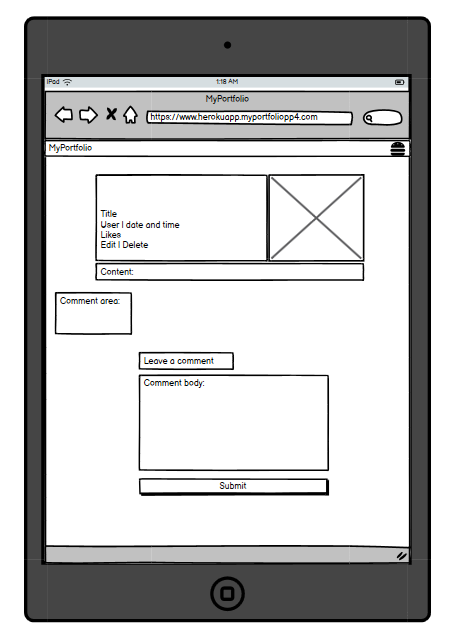
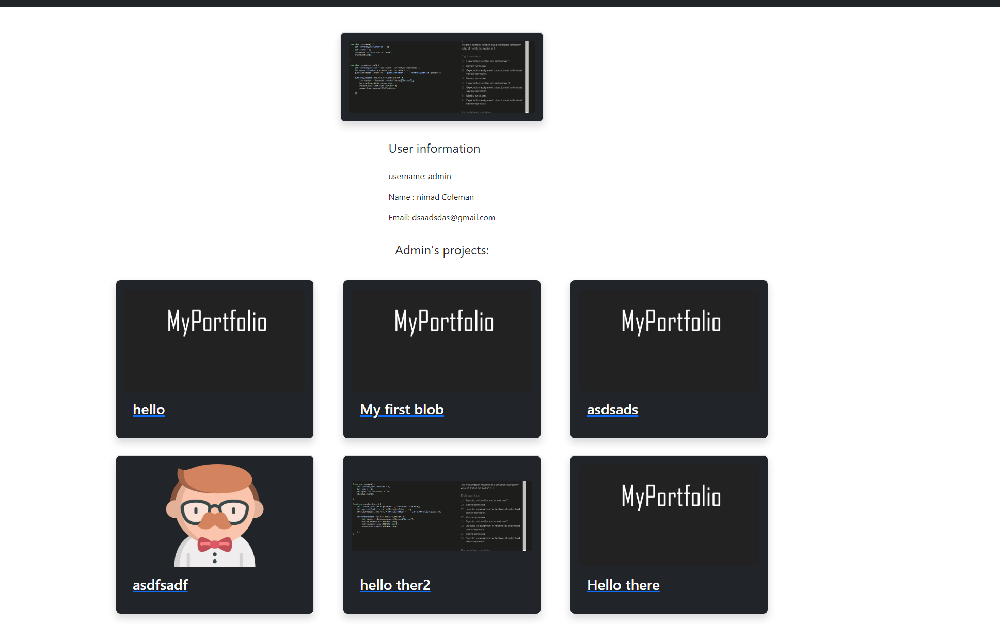
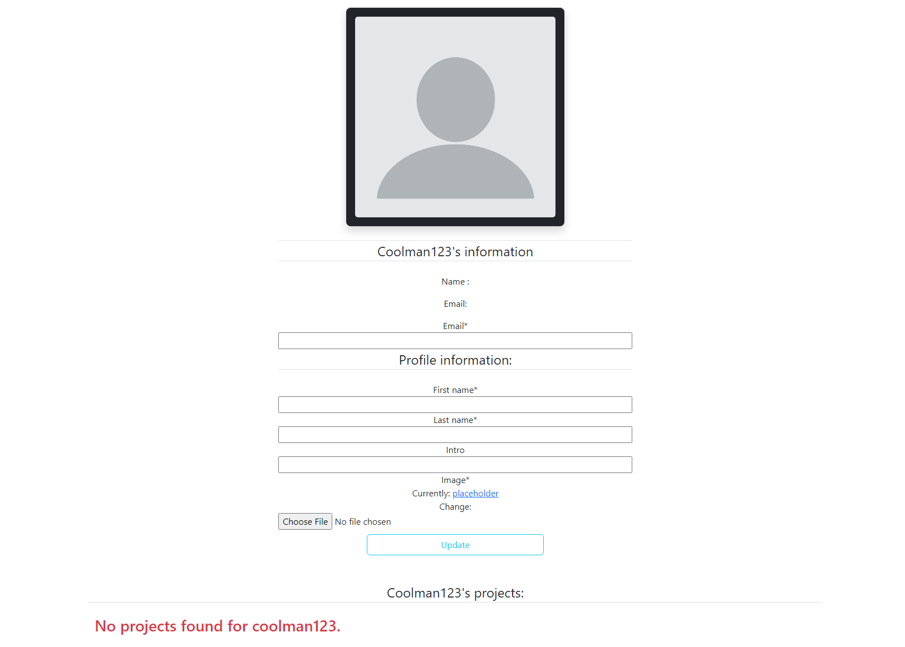
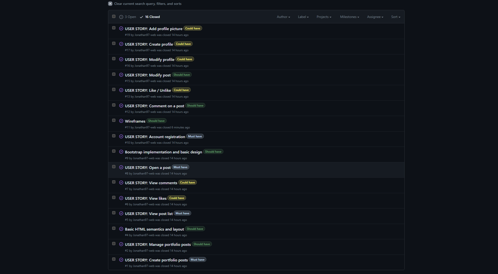

# MyPortfolio

MyPortfolio is a social media page where you can share your portfolio's with future employers and other developers to showcase your projects and what you are currently up to. This website was created with HTML, CSS, JS, Django, Bootstrap and Agile.


[Live site](https://myportfoliopp4.herokuapp.com/)


## UX

I wanted to create a website that is clean and easy to use, there are many websites out there that focus to much on cluttering the website with a ton of different colors and a ton of different functions.  
With MyPortfolio you will get a clean and easy to use experience.

### Colour Scheme

I used primarily bootstrap's implemented class colors when creating my project.  
Link: [Bootstrap colors](https://getbootstrap.com/docs/5.2/utilities/colors/)


- `#212429` used for primary text and card backgrounds on front page.
- `#445261` used for masthead backgrounds.
- `#CED4DA` used for comments background and content background
- `#E84610 + #FF0000` used for hover highlights.
- `#FFFFFF` used for background color.


I used [coolors.co](https://coolors.co/212529-445261-ced4da-ffffff-e84610-ff0000) to generate my colour palette.


### Typography

I used the standard Bootstrap fonts, no other fonts were used.  
Link here:
[Bootstrap Typography](https://getbootstrap.com/docs/5.3/content/typography/)
## User Stories

### To view Github issues follow this [link](https://github.com/Jonathan97-web/MyPortfolio/issues)
### To view Github projects page follow this [link](https://github.com/users/Jonathan97-web/projects/2)

### New Site Users

- As a new site user, I would like to register, so that I can use the functions of the website.
- As a new site user, I would like to create a profile, so that I can interact with other people.
- As a new site user, I would like to create a project post, so that I can share my portfolio to other people.
- As a new site user, I would like to navigate easily, so that I can understand where to go on the website.
- As a new site user, I would like to comment on posts, so that I can interact with other people.

### Returning Site Users

- As a returning site user, I would like to modify my posts, so that I can update them accordingly if changes are made.
- As a returning site user, I would like to modify my profile, so that I can change information if updated.
- As a returning site user, I would like to view other users posts, so that I can see updates on the website.
- As a returning site user, I would like to see others profiles, so that I can check on updates they made.
- As a returning site user, I would like to be able to like posts, so that I can show endorsement to other peoples work.

### Site Admin

- As a site administrator, I should be able to access the administration panel, so that I can overview the website.
- As a site administrator, I should be able to delete projects and comments, so that I can moderate the website. 
- As a site administrator, I should be able to see profiles, so that I can moderate the profiles.

###  User Stories that aren't yet implemented

I made some user stories that aren't implemented yet due to time constraints and these are on the backlog in the Github project tab  
Link here: [Github Projects](https://github.com/users/Jonathan97-web/projects/2)

## Wireframes


To follow best practice, wireframes were developed for mobile, tablet, and desktop sizes.
I've used [Balsamiq](https://balsamiq.com/wireframes) to design my site wireframes.

### Home Page Wireframes

| Size | Screenshot |
| --- | --- |
| Mobile |  |
| Tablet |  |
| Desktop |  |

### Profile Page Wireframes

| Size | Screenshot |
| --- | --- |
| Mobile |  |
| Tablet |  |
| Desktop |  |

### Project Detail Page Wireframes

| Size | Screenshot |
| --- | --- |
| Mobile |  |
| Tablet |  |
| Desktop |  |

### Create Project Page Wireframes

| Size | Screenshot |
| --- | --- |
| Mobile |  |
| Tablet |  |
| Desktop |  |


## Features

### Existing Features

- **View Project Posts other users have posted**

    - Users can view eachothers project posts on the home page and also go to their specific projects.

    - The author's name can be clicked to go to the author's profile page.


- **View other users Profiles**

    - A user can go to another users profile and look at their information and see their projects that they have posted previously.



- **View your own Profile**

    - A user can go to their own profile and edit their information.



- **Comment on posts**

    - A user can comment on project posts, a user can also edit or delete their own comments. The comment function is tied to the users own id so you can see exactly who commented and the comment author is also clickable to directly go to the user's profile. There is also a comment counter that counts how many comments there are currently.


- **Like a Project Post**

    - A user can like a project and also unlike it, the function checks for the user's ID so that you cannot like a post twice from the same account.


- **Sign up page**

    - A user can sign up as a user to be able to access all the functions of the website.


**Create a Project Post**

    - A user can create a project post that all other users can see, like and comment.


### Future Features


- Share button for posts with integrated links
    - Being able to share your posts with the click of a button is important for a social media page.
- Share button for profiles
    - Send your profiles with the click of a button to recipents you want to showcase your profile for.
- Search bar for projects.
    - Search for specific projects and posts.

## Tools & Technologies Used

- [HTML](https://en.wikipedia.org/wiki/HTML) used for the main site content.
- [CSS](https://en.wikipedia.org/wiki/CSS) used for the main site design and layout.
- [CSS Flexbox](https://www.w3schools.com/css/css3_flexbox.asp) used for an enhanced responsive layout.
- [Python](https://www.python.org) used as the back-end programming language.
- [Git](https://git-scm.com) used for version control. (`git add`, `git commit`, `git push`)
- [GitHub](https://github.com) used for secure online code storage.
- [Gitpod](https://gitpod.io) used as a cloud-based IDE for development.
- [Bootstrap](https://getbootstrap.com) used as the front-end CSS framework for modern responsiveness and pre-built components.
- [Django](https://www.djangoproject.com) used as the Python framework for the site.
- [PostgreSQL](https://www.postgresql.org) used as the relational database management.
- [ElephantSQL](https://www.elephantsql.com) used as the Postgres database.
- [Heroku](https://www.heroku.com) used for hosting the deployed back-end site.
- [Cloudinary](https://cloudinary.com) used for online static file storage.
- [Lucidchart](https://www.lucidchart.com) used to create the ERD flowchart.
## Database Design

Entity Relationship Diagrams (ERD) help to visualize database architecture before creating models.
Understanding the relationships between different tables can save time later in the project.

```python
class Project(models.Model):
    title = models.CharField(max_length=100, unique=True)
    slug = models.SlugField(max_length=100, unique=True)
    developer = models.ForeignKey(User, on_delete=models.CASCADE)
    updated_on = models.DateTimeField(auto_now=True)
    content = models.TextField()
    image = CloudinaryField('image', default='placeholder')
    created_on = models.DateTimeField(auto_now_add=True)
    likes = models.ManyToManyField(
        User, related_name='project_likes', blank=True)
    source_code = models.URLField(null=True, blank=True)
    deployed_url = models.URLField(null=False, blank=False)

    def __str__(self):
        return self.title

    def number_of_likes(self):
        return self.likes.count()
```


I made a ERD from Lucidchart and I also generated one using Graphviz.


- **Project Model:**

    | **PK** | **id** (unique) | Type | Notes |
    | --- | --- | --- | --- |
    | **FK** | category | ForeignKey | FK to **Category** model |
    | | title | CharField | |
    | | slug | SlugField | |
    | | developer | ForeignKey | |
    | | image | CloudinaryField | |
    | | created_on | DateTimeField | |
    | | likes | ManyToManyField | |
    | | source_code | URLField | |
    | | deployed_url | URLField | |

## Agile Development Process

### GitHub Projects

[GitHub Projects](https://github.com/Jonathan97-web/MyPortfolio/projects) served as an Agile tool for this project.

Through it, user stories, issues, and milestone tasks were planned, then tracked on a weekly basis using the basic Kanban board.


### GitHub Issues

[GitHub Issues](https://github.com/Jonathan97-web/MyPortfolio/issues) served as an another Agile tool.
There, I used my own **User Story Template** to manage user stories.

It also helped with milestone iterations on a weekly basis.


- [Open Issues](https://github.com/Jonathan97-web/MyPortfolio/issues)

    

- [Closed Issues](https://github.com/Jonathan97-web/MyPortfolio/issues?q=is%3Aissue+is%3Aclosed)

    

### MoSCoW Prioritization

I've decomposed my Epics into stories prior to prioritizing and implementing them.
Using this approach, I was able to apply the MoSCow prioritization and labels to my user stories within the Issues tab.

- **Must Have**: guaranteed to be delivered (*max 60% of stories*)
- **Should Have**: adds significant value, but not vital (*the rest ~20% of stories*)
- **Could Have**: has small impact if left out (*20% of stories*)
- **Won't Have**: not a priority for this iteration

## Testing

For all testing, please refer to the [TESTING.md](TESTING.md) file.

## Deployment

The live deployed application can be found deployed on [Heroku](https://myportfoliopp4.herokuapp.com).

### ElephantSQL Database

This project uses [ElephantSQL](https://www.elephantsql.com) for the PostgreSQL Database.

To obtain your own Postgres Database, sign-up with your GitHub account, then follow these steps:
- Click **Create New Instance** to start a new database.
- Provide a name (this is commonly the name of the project: MyPortfolio).
- Select the **Tiny Turtle (Free)** plan.
- You can leave the **Tags** blank.
- Select the **Region** and **Data Center** closest to you.
- Once created, click on the new database name, where you can view the database URL and Password.

### Cloudinary API

This project uses the [Cloudinary API](https://cloudinary.com) to store media assets online, due to the fact that Heroku doesn't persist this type of data.

To obtain your own Cloudinary API key, create an account and log in.
- For *Primary interest*, you can choose *Programmable Media for image and video API*.
- Optional: *edit your assigned cloud name to something more memorable*.
- On your Cloudinary Dashboard, you can copy your **API Environment Variable**.
- Be sure to remove the `CLOUDINARY_URL=` as part of the API **value**; this is the **key**.

### Heroku Deployment

This project uses [Heroku](https://www.heroku.com), a platform as a service (PaaS) that enables developers to build, run, and operate applications entirely in the cloud.

Deployment steps are as follows, after account setup:

- Select **New** in the top-right corner of your Heroku Dashboard, and select **Create new app** from the dropdown menu.
- Your app name must be unique, and then choose a region closest to you (EU or USA), and finally, select **Create App**.
- From the new app **Settings**, click **Reveal Config Vars**, and set your environment variables.

| Key | Value |
| --- | --- |
| `CLOUDINARY_URL` | user's own value |
| `DATABASE_URL` | user's own value |
| `DISABLE_COLLECTSTATIC` | 1 (*this is temporary, and can be removed for the final deployment*) |
| `SECRET_KEY` | user's own value |

Heroku needs two additional files in order to deploy properly.
- requirements.txt
- Procfile

You can install this project's **requirements** (where applicable) using:
- `pip3 install -r requirements.txt`

If you have your own packages that have been installed, then the requirements file needs updated using:
- `pip3 freeze --local > requirements.txt`

The **Procfile** can be created with the following command:
- `echo web: gunicorn app_name.wsgi > Procfile`
- *replace **app_name** with the name of your primary Django app name; the folder where settings.py is located*

For Heroku deployment, follow these steps to connect your own GitHub repository to the newly created app:

Either:
- Select **Automatic Deployment** from the Heroku app.

Or:
- In the Terminal/CLI, connect to Heroku using this command: `heroku login -i`
- Set the remote for Heroku: `heroku git:remote -a app_name` (replace *app_name* with your app name)
- After performing the standard Git `add`, `commit`, and `push` to GitHub, you can now type:
	- `git push heroku main`

The project should now be connected and deployed to Heroku!

### Local Deployment

This project can be cloned or forked in order to make a local copy on your own system.

For either method, you will need to install any applicable packages found within the *requirements.txt* file.
- `pip3 install -r requirements.txt`.

You will need to create a new file called `env.py` at the root-level,
and include the same environment variables listed above from the Heroku deployment steps.

Sample `env.py` file:

```python
import os

os.environ.setdefault("CLOUDINARY_URL", "user's own value")
os.environ.setdefault("DATABASE_URL", "user's own value")
os.environ.setdefault("SECRET_KEY", "user's own value")

# local environment only (do not include these in production/deployment!)
os.environ.setdefault("DEBUG", "True")
```

Once the project is cloned or forked, in order to run it locally, you'll need to follow these steps:
- Start the Django app: `python3 manage.py runserver`
- Stop the app once it's loaded: `CTRL+C` or `⌘+C` (Mac)
- Make any necessary migrations: `python3 manage.py makemigrations`
- Migrate the data to the database: `python3 manage.py migrate`
- Create a superuser: `python3 manage.py createsuperuser`
- Load fixtures (if applicable): `python3 manage.py loaddata file-name.json` (repeat for each file)
- Everything should be ready now, so run the Django app again: `python3 manage.py runserver`

#### Cloning

You can clone the repository by following these steps:

1. Go to the [GitHub repository](https://github.com/Jonathan97-web/MyPortfolio) 
2. Locate the Code button above the list of files and click it 
3. Select if you prefer to clone using HTTPS, SSH, or GitHub CLI and click the copy button to copy the URL to your clipboard
4. Open Git Bash or Terminal
5. Change the current working directory to the one where you want the cloned directory
6. In your IDE Terminal, type the following command to clone my repository:
	- `git clone https://github.com/Jonathan97-web/MyPortfolio.git`
7. Press Enter to create your local clone.

Alternatively, if using Gitpod, you can click below to create your own workspace using this repository.

[](https://gitpod.io/#https://github.com/Jonathan97-web/MyPortfolio)

Please note that in order to directly open the project in Gitpod, you need to have the browser extension installed.
A tutorial on how to do that can be found [here](https://www.gitpod.io/docs/configure/user-settings/browser-extension).

#### Forking

By forking the GitHub Repository, we make a copy of the original repository on our GitHub account to view and/or make changes without affecting the original owner's repository.
You can fork this repository by using the following steps:

1. Log in to GitHub and locate the [GitHub Repository](https://github.com/Jonathan97-web/MyPortfolio)
2. At the top of the Repository (not top of page) just above the "Settings" Button on the menu, locate the "Fork" Button.
3. Once clicked, you should now have a copy of the original repository in your own GitHub account!

### Local VS Deployment

As of writing this there should be no difference between the local version and the deployed one.
## Credits


### Content

In the project I used the comment and likes view from Code Institute's blog application.

| Source | Location | Notes |
| --- | --- | --- |
| [Markdown Builder](https://traveltimn.github.io/markdown-builder) | README and TESTING | tool to help generate the Markdown files |
| [Chris Beams](https://chris.beams.io/posts/git-commit) | version control | "How to Write a Git Commit Message" |
| [Bootstrap](https://getbootstrap.com/) | Framework | Documentation to make the CSS possible |
| [Codey Schafer](https://github.com/CoreyMSchafer/code_snippets/blob/master/Django_Blog/11-Pagination/django_project/users/signals.py) | Code Snippet | Create user profile when user is created
### Media

| Source | Location | Type | Notes |
| --- | --- | --- | --- |
| [Favicon](https://www.favicon.io) | entire site | image | favicon on all pages |
| [Pixabay](https://pixabay.com/vectors/blank-profile-picture-mystery-man-973460/) | Placeholder profile picture |  image | Placeholder for profile picture |
| [Myself](https://www.github.com/Jonathan97-web) | project placeholder images | image | Made the images for the project placeholders in Photoshop

### Acknowledgements

- I would like to thank my Code Institute mentor, [Tim Nelson](https://github.com/TravelTimN) for their support throughout the development of this project.
- I would like to thank the [Code Institute](https://codeinstitute.net) tutor team for their assistance with troubleshooting and debugging some project issues.
- I would like to thank the [Code Institute Slack community](https://code-institute-room.slack.com) for the moral support; it kept me going during periods of self doubt and imposter syndrome.
- I would like to thank my partner Merle, for believing in me, and allowing me to make this transition into software development.
- I would like to thank my employer, for supporting me in my career development change towards becoming a software developer.
